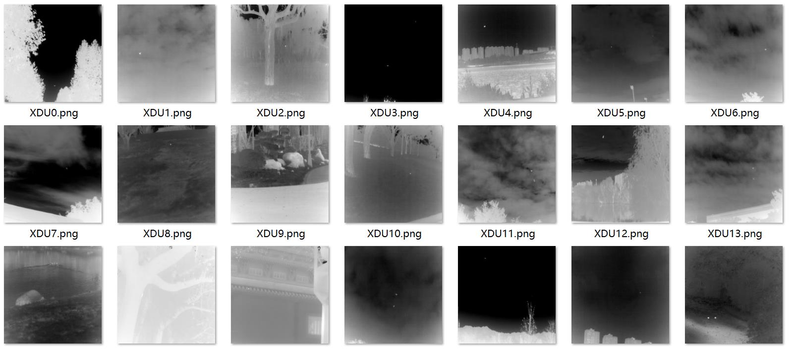
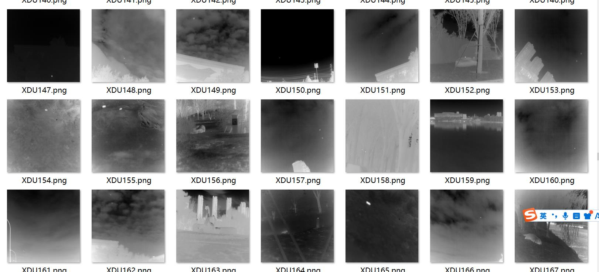
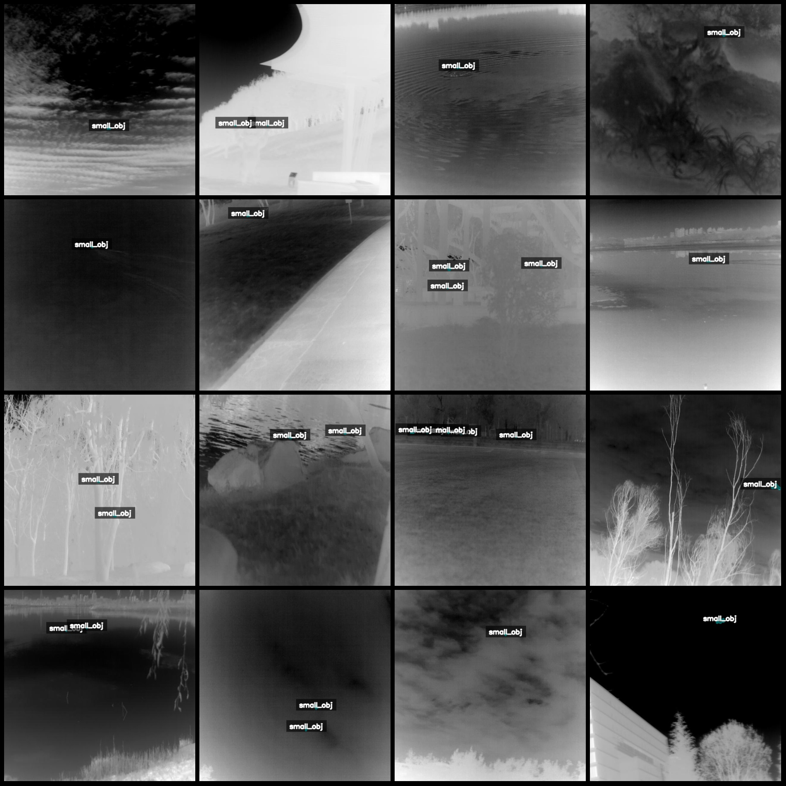
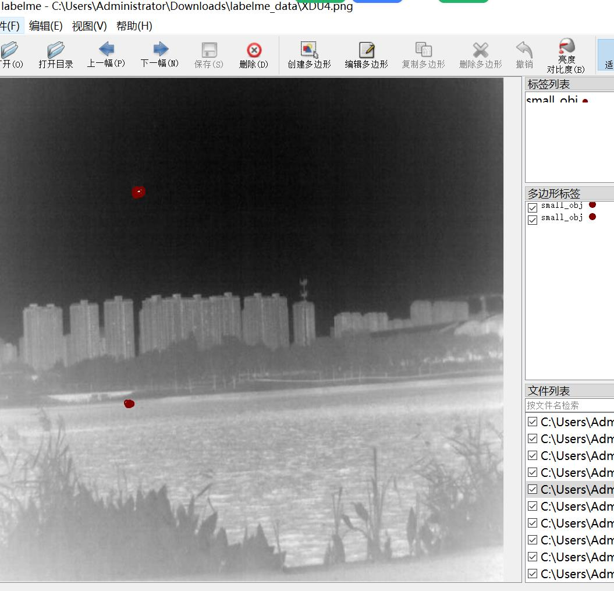

# IRSTD-1k Dataset: Infrared Minimal Object Recognition and Segmentation in LabelMe Format with 1001 Images in One Category

Please note that the original dataset does not provide labelme format, only mask images. It is inconvenient to convert it into coco or yolo format for training. Therefore, this dataset has been 
relabeled using labelme.

Dataset format: labelme format (without mask files, only containing png images and corresponding json files).

Number of images (number of png files): 1001
Number of annotations (json file count): 1001
Number of categories: 1
Annotation category name: "small_obj"
Number of bounding box counts per category: 1486
Total bounding box counts: 1486

Annotation tool used: labelme=5.5.0
Image resolution: 512x512
Annotation rules: Polygons are drawn around the categories.

Important note: You can edit the dataset using labelme, but the json dataset needs to be converted into mask or yolo format for semantic segmentation or instance segmentation.

Special declaration: This dataset does not guarantee the accuracy of the trained models or weight files.

Preview of images:

Annotation example:

Original image (select 16 images at random):

Annotation drawing result:

Labelme editing image example:

## Images

Here is a pay link on Stripe ( https://buy.stripe.com/3cs8yP7sY87d0vu9AB ). Please contact me lonlonago@foxmail.com after funding $89, and I will send you a complete data files , thank you!

